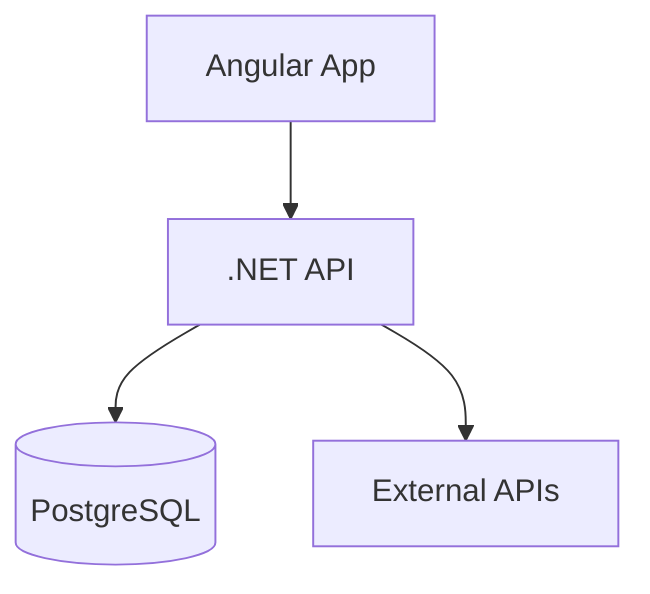

# Foundation Setup

> Project structure and documentation setup that enables AI-assisted development.

---

## The Critical Insight

> **"Laying the proper foundation is key to accelerated delivery."**

Most teams rush to code. We did the opposite. We invested time upfront to:

1. Define the project structure
2. Select and document architectural patterns
3. Create a mental model of how components interact
4. Establish guardrails that AI could respect

---

## Why This Works with AI

Traditional development can tolerate messy foundations—experienced developers navigate chaos. AI cannot. AI excels when:

* **Structure is clear**: Folder hierarchy reflects architecture
* **Patterns are documented**: Consistent approaches to solve similar problems
* **Context is explicit**: Every prompt includes architectural guardrails

---

## Foundation Setup Checklist

### Week 1: Foundation (Day 1 - 2)

#### Project Setup

* [ ] Create solution/project structure
* [ ] Set up Docker Compose
* [ ] Verify F5 debugging works in IDE
* [ ] Create initial database migration

#### Documentation Setup

* [ ] Create README.md with quick start
* [ ] Create DESIGN_PATTERNS.md (define patterns you'll use)
* [ ] Create PROJECT_STRUCTURE.md (map folders to architecture)
* [ ] Create ARCHITECTURE.md (Mermaid diagrams)
* [ ] Create TEST_AUTOMATION_STRATEGY.md (define testing pyramid)

#### Team Alignment

* [ ] Review and agree on patterns
* [ ] Establish communication protocol
* [ ] Set up pair prompting process
* [ ] Define "done" criteria (code + tests + docs)

---

## Step 1: Create Solution Structure

**For .NET projects**, create a proper solution structure:

```bash
# Create solution
dotnet new sln -n RepoRadar

# Create projects
dotnet new webapi -n RepoRadar.API
dotnet new angular -n RepoRadar.Web
dotnet new xunit -n RepoRadar.API.Tests

# Add to solution
dotnet sln add RepoRadar.API
dotnet sln add RepoRadar.Web
dotnet sln add RepoRadar.API.Tests

# Add Docker Compose support (in Visual Studio)
# Right-click solution → Add → Container Orchestrator Support → Docker Compose
```

**Why this matters**:

* Opens seamlessly in Visual Studio
* F5 debugging works out of the box
* All projects build together
* Easy to set Docker Compose as startup project

---

## Step 2: Document Your Patterns

Create a **DESIGN_PATTERNS.md** file that explains:

1. **What** each pattern is
2. **Why** you're using it
3. **How** it's implemented in your project
4. **Examples** from your actual codebase

**This becomes your AI's instruction manual.**

---

## Step 3: Create Architecture Documentation

Create an **ARCHITECTURE.md** with Mermaid diagrams:

* System overview (components and dependencies)
* Data flow diagrams
* Component architecture
* Deployment architecture

**Why**: Visual diagrams are incredibly helpful for AI context and human understanding.

### Example

````markdown
## System Overview


````

---

## Step 4: Define Your Testing Pyramid

Create a **TEST_AUTOMATION_STRATEGY.md** that documents:

```
        /\
       /  \  E2E Tests (10%)
      /____\  Critical user journeys
     /      \
    / Inte-  \ Integration Tests (30%)
   / gration  \ API + Database
  /____________\
 /              \ Unit Tests (60%)
/  Unit Tests    \ Business logic
```

**Define specifics**:
- Unit Tests: Service layer, business logic, calculations
- Integration Tests: API controllers with real database
- E2E Tests: Critical flows (login, create, update, delete)

**Why**: This guides AI when you ask it to generate tests.

---

## Step 5: Create Project Structure Document

Create **PROJECT_STRUCTURE.md** that maps files to architecture:

```markdown
## Backend Structure

RepoRadar.API/
├── Controllers/              # API Endpoints (HTTP layer)
│   └── TeamsController.cs    # Handles /api/teams requests
├── Services/                 # Business Logic Layer
│   └── TeamService.cs        # Team operations, validation
├── Repositories/             # Data Access Layer
│   └── TeamRepository.cs     # Database queries for teams
└── Models/                   # Domain Entities
    └── Team.cs               # Team domain model
```

**Why**: Helps AI understand where to create/modify files.

---

## Foundation Over Speed

**80/20 Rule**: 20% of your time on foundation = 80% of your velocity later.

**Invest upfront in**:

* Clear architecture
* Documented patterns
* Project structure
* Testing strategy

**Skip**:

* Premature optimization
* Bikeshedding on tools
* Over-engineering for scale

---

## Key Takeaways

1. **Foundation first** - Invest 1-2 days upfront
2. **Document everything** - Patterns, structure, architecture, testing
3. **Visual diagrams** - Mermaid diagrams help AI understand
4. **Structure reflects architecture** - Folder hierarchy should be self-explanatory
5. **Team alignment** - Everyone agrees on patterns and approach

---

## Reference

- Framework Source: `docs/ai-pod/common/accelerated-delivery-framework.md` (lines 28-299, 1274-1349)
- Getting Started Checklist: Lines 1274-1349
- Foundation Setup: Lines 167-299
