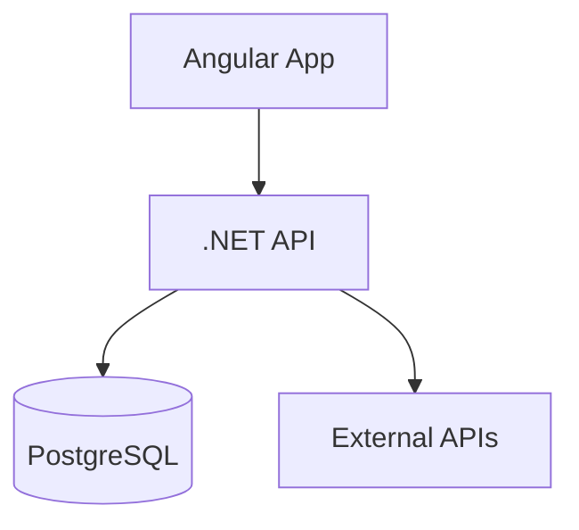

# AI Pod Team Playbook: Accelerated Delivery Framework

**Source**: [Confluence](https://purplegroup3.atlassian.net/wiki/spaces/~71202084a891b0fa2b41c68012648ea12e1f4e/pages/5024448547/AI+Pod+Team+Playbook+Accelerated+Delivery+Framework)  
**Last Updated**: 2026-02-03

---

## Executive Summary

### The Secret

The acceleration wasn't magic—it was methodical:

1. **Foundation First**: Proper project structure and architectural patterns before writing code
2. **Mental Models**: Clear building blocks defined before execution
3. **Pattern Adherence**: Every prompt started with architectural context and planning
4. **Shift-Left Testing**: Testing pyramid defined early, AI-generated tests at all layers
5. **Self-Service Model**: Empowered decision-making and rapid unblocking

### Key Metrics

* **Velocity**: 875% faster than traditional waterfall estimation
* **Team Size**: 2-3 person pod team
* **Scope**: Full-stack application with authentication, observability, and production deployment

---

## The Foundation: Why Project Setup Matters

### The Critical Insight

> **"Laying the proper foundation is key to accelerated delivery."**

Most teams rush to code. We did the opposite. We invested time upfront to:

1. Define the project structure
2. Select and document architectural patterns
3. Create a mental model of how components interact
4. Establish guardrails that AI could respect

### Why This Works with AI

Traditional development can tolerate messy foundations—experienced developers navigate chaos. AI cannot. AI excels when:

* **Structure is clear**: Folder hierarchy reflects architecture
* **Patterns are documented**: Consistent approaches to solve similar problems
* **Context is explicit**: Every prompt includes architectural guardrails

---

## Phase 1: Strategic Planning & Mental Models

### Step 1.1: Define Your Building Blocks

Before writing a single line of code, answer these questions:

#### Architecture Questions

1. What is the high-level architecture? (e.g., API + SPA + Database)
2. What are the major components? (e.g., Authentication, Authorization, Business Logic, External Integrations)
3. How do components communicate? (REST, GraphQL, gRPC, Events)
4. Where are boundaries drawn? (Frontend/Backend, Modules, Domains)

#### Technology Questions

1. What's the backend stack? (Language, Framework, ORM)
2. What's the frontend stack? (Framework, State Management, UI Library)
3. What's the infrastructure? (Docker, Kubernetes, Serverless)
4. What external services? (Auth provider, Secret management, Observability)

#### Pattern Questions

1. How will you access data? (Repository pattern, Direct ORM, Query objects)
2. How will you manage transactions? (Unit of Work, Ambient transactions)
3. How will you transfer data? (DTOs, Domain models, GraphQL types)
4. How will you inject dependencies? (Built-in DI, 3rd-party container)

#### Example: RepoRadar Building Blocks

```
┌─────────────────────────────────────────────────────┐
│           RepoRadar Mental Model                 │
├─────────────────────────────────────────────────────┤
│                                                  │
│  Frontend (Angular 18)                           │
│  ├── Component-based architecture                │
│  ├── Service layer (API calls)                   │
│  ├── RxJS for reactive state                     │
│  └── Angular Material UI                         │
│                                                  │
│  Backend (.NET 8 API)                            │
│  ├── Controller → Service → Repository → DB      │
│  ├── Repository Pattern (data access)            │
│  ├── Unit of Work (transactions)                 │
│  ├── DTO Pattern (API contracts)                 │
│  └── Dependency Injection (all layers)           │
│                                                  │
│  Database (PostgreSQL)                           │
│  ├── EF Core Code-First                          │
│  ├── Migration-based schema management           │
│  └── GUID primary keys                           │
│                                                  │
│  Infrastructure                                  │
│  ├── Docker Compose orchestration                │
│  ├── Azure AD authentication                     │
│  └── External API integrations (Codacy, GitHub)  │
│                                                  │
└─────────────────────────────────────────────────────┘
```

### Step 1.2: Select Proven Patterns

**Don't invent. Select from proven patterns.**

For RepoRadar, we chose:

* **Repository Pattern**: Abstracts data access, enables testing
* **Unit of Work**: Manages transactions across multiple repositories
* **DTO Pattern**: Separates API contracts from domain models
* **Dependency Injection**: Loose coupling, testability
* **Service Layer**: Encapsulates business logic

**Document WHY each pattern was selected**:

* Repository: Needed to mock data access for unit tests
* Unit of Work: Multiple entities modified per request (teams + repositories)
* DTOs: Frontend models differ from database models
* DI: Microsoft best practice, built-in support
* Service Layer: Complex business logic (tech debt scoring)

### Step 1.3: Create Your Project Structure

Design your folder structure to reflect your architecture.

#### Bad Structure (No clear architecture):

```
src/
├── files/
├── stuff/
├── utils/
└── code.cs
```

#### Good Structure (Architecture-aligned):

```
RepoRadar.API/
├── Controllers/          # HTTP layer
├── Services/            # Business logic
│   ├── Interfaces/
│   └── Implementations/
├── Repositories/        # Data access
│   ├── Interfaces/
│   └── Implementations/
├── Models/              # Domain entities
├── DTOs/                # API contracts
├── Core/                # Cross-cutting (UnitOfWork)
├── Data/                # DbContext
└── Infrastructure/      # External APIs
```

**Principle**: A developer (or AI) should look at the folder structure and immediately understand the architecture.

---

## Phase 2: Foundation Setup

### Step 2.1: Create the Visual Studio Solution

**For .NET projects**, create a proper solution structure:

```bash
# Create solution
dotnet new sln -n RepoRadar

# Create projects
dotnet new webapi -n RepoRadar.API
dotnet new angular -n RepoRadar.Web
dotnet new xunit -n RepoRadar.API.Tests

# Add to solution
dotnet sln add RepoRadar.API
dotnet sln add RepoRadar.Web
dotnet sln add RepoRadar.API.Tests

# Add Docker Compose support (in Visual Studio)
# Right-click solution → Add → Container Orchestrator Support → Docker Compose
```

**Why this matters**:

* Opens seamlessly in Visual Studio
* F5 debugging works out of the box
* All projects build together
* Easy to set Docker Compose as startup project

### Step 2.2: Document Your Patterns

Create a **DESIGN_PATTERNS.md** file that explains:

1. **What** each pattern is
2. **Why** you're using it
3. **How** it's implemented in your project
4. **Examples** from your actual codebase

**This becomes your AI's instruction manual.**

Example structure:

```markdown
# Design Patterns Guide

## 1. Repository Pattern

### What is it?
[Explanation]

### Why use it?
✅ Testability
✅ Maintainability
✅ Separation of concerns

### How we use it
[Code example from your project]

### When to use this pattern
[Guidelines]
```

**Critical**: Include real code examples from your project, not generic samples.

### Step 2.3: Create Architecture Documentation

Create an **ARCHITECTURE.md** with Mermaid diagrams:

* System overview (components and dependencies)
* Data flow diagrams
* Component architecture
* Deployment architecture

**Why**: Visual diagrams are incredibly helpful for AI context and human understanding.

Example:

````markdown
## System Overview


````

### Step 2.4: Define Your Testing Pyramid

Create a **TEST_AUTOMATION_STRATEGY.md** that documents:

```
        /\
       /  \  E2E Tests (10%)
      /____\  Critical user journeys
     /      \
    / Inte-  \ Integration Tests (30%)
   / gration  \ API + Database
  /____________\
 /              \ Unit Tests (60%)
/  Unit Tests    \ Business logic
```

**Define specifics**:
- Unit Tests: Service layer, business logic, calculations
- Integration Tests: API controllers with real database
- E2E Tests: Critical flows (login, create, update, delete)

**Why**: This guides AI when you ask it to generate tests.

### Step 2.5: Create a Project Structure Document

Create **PROJECT_STRUCTURE.md** that maps files to architecture:

```markdown
## Backend Structure

RepoRadar.API/
├── Controllers/              # API Endpoints (HTTP layer)
│   └── TeamsController.cs    # Handles /api/teams requests
├── Services/                 # Business Logic Layer
│   └── TeamService.cs        # Team operations, validation
├── Repositories/             # Data Access Layer
│   └── TeamRepository.cs     # Database queries for teams
└── Models/                   # Domain Entities
    └── Team.cs               # Team domain model
```

**Why**: Helps AI understand where to create/modify files.

---

## Phase 3: Pattern-Driven Development

### The Core Principle

> **"With every prompt I started with: get context of architecture patterns used and plan before we execute, forcing us to stick to the patterns we laid out."**

### The Workflow

#### ❌ BAD: Direct Implementation Request

```
Prompt: "Add a new endpoint to get teams"
```

**Problem**: AI will create code without considering existing patterns.

#### ✅ GOOD: Context → Plan → Execute

```
Prompt: "I need to add an endpoint to get all teams.

Before implementing:
1. Review our DESIGN_PATTERNS.md to understand our patterns
2. Look at existing controllers to see our approach
3. Review how we structure services and repositories
4. Provide a plan that follows our established patterns

Once you have the plan, implement:
- Controller endpoint following our controller pattern
- Service method following our service layer pattern  
- Repository method if needed
- DTOs following our DTO pattern
- Include proper dependency injection"
```

**Result**: AI generates code consistent with your architecture.

### Example: Adding a Feature

#### Prompt Template

```
Task: [What you want to build]

Context Gathering:
1. Read DESIGN_PATTERNS.md - Review our architectural patterns
2. Read PROJECT_STRUCTURE.md - Understand where files should go
3. Read [existing similar feature] - See existing implementation
4. Identify the layers affected (Controller, Service, Repository, Model, DTO)

Planning:
1. List all files to create/modify
2. Describe how this fits our existing patterns
3. Identify any deviations and justify them
4. Outline the implementation steps

Implementation:
[Now implement following the plan]

Testing:
[Follow our testing pyramid - unit, integration, E2E]
```

### Real Example: RepoRadar Team Management

**Prompt**:

```
I need to implement team management (CRUD operations).

Context:
- Review DESIGN_PATTERNS.md for our Repository and Unit of Work patterns
- Look at how we structured database entities (BaseEntity pattern)
- Review our DTO pattern for API contracts

Plan:
1. Database layer:
   - Create Team entity (extends BaseEntity)
   - Add DbSet to RepoRadarDbContext
   - Create migration

2. Repository layer:
   - Create ITeamRepository (extends IRepository<Team>)
   - Implement TeamRepository (extends Repository<Team>)
   - Add specialized methods (GetTeamWithRepositories)

3. Service layer:
   - Create ITeamService interface
   - Implement TeamService
   - Inject IUnitOfWork
   - Business logic and validation

4. API layer:
   - Create DTOs (TeamDto, CreateTeamDto, UpdateTeamDto)
   - Create TeamsController
   - Inject ITeamService
   - Standard REST endpoints (GET, POST, PUT, DELETE)

Execute following our dependency injection pattern.
```

**Result**: AI generates code that perfectly matches existing patterns.

### Pattern Adherence Checklist

After AI generates code, verify:

* ✅ Files in correct folders per PROJECT_STRUCTURE.md
* ✅ Patterns match DESIGN_PATTERNS.md
* ✅ Dependencies injected via constructor
* ✅ DTOs used for API contracts
* ✅ Repository methods async
* ✅ Service layer has business logic
* ✅ Controllers are thin (delegate to services)

---

## Phase 4: AI-Augmented Testing

### The Testing Philosophy

> **"Shifting left with testing, but it goes even deeper—you need to become a self-serviced AI pod team."**

### Step 4.1: Define Your Testing Layers

Early in the project, create detailed testing documentation:

1. **Unit Tests** (60% of tests)

    * What: Pure business logic, calculations, transformations
    * Tools: xUnit (C#), Jasmine/Jest (TypeScript)
    * Mocking: All dependencies mocked
    * Speed: < 1ms per test
    
2. **Integration Tests** (30% of tests)

    * What: API endpoints with real database
    * Tools: WebApplicationFactory (C#), Playwright (E2E)
    * Mocking: External APIs mocked, database real
    * Speed: 100-500ms per test
    
3. **E2E Tests** (10% of tests)

    * What: Critical user journeys
    * Tools: Playwright
    * Mocking: Nothing mocked
    * Speed: 5-30s per test
    

### Step 4.2: AI-Generated Tests

**Prompt for Unit Tests**:

```
Task: Generate unit tests for AnalysisService

Context:
1. Review TEST_AUTOMATION_STRATEGY.md for our testing approach
2. Look at existing tests (e.g., TeamServiceTests.cs) for patterns
3. Review the service to understand all methods

Requirements:
- Test all public methods
- Cover happy path and error cases
- Mock all dependencies (IUnitOfWork, ICodacyClient, ILogger)
- Follow xUnit conventions
- Use Theory/InlineData for parameterized tests
- Assert on return values and mock interactions

Generate:
- Test class with proper setup (constructor, mocks)
- At least 3 test cases per public method
- Use descriptive test names (MethodName_Scenario_ExpectedResult)
```

**Prompt for Integration Tests**:

```
Task: Generate integration tests for TeamsController

Context:
1. Review how we use WebApplicationFactory
2. Look at existing integration tests
3. Review our API response pattern (success/error format)

Requirements:
- Test all CRUD endpoints
- Use in-memory database
- Test both success and error scenarios
- Verify HTTP status codes
- Verify response structure
- Clean up data between tests

Generate:
- Test class inheriting from our base integration test class
- Tests for GET, POST, PUT, DELETE
- Negative test cases (not found, validation errors)
```

**Prompt for E2E Tests**:

```
Task: Generate E2E test for team management flow

Context:
1. Review MANUAL_REGRESSION_TESTING.md for user flows
2. Look at existing Playwright tests
3. Understand our authentication flow

Requirements:
- Test complete flow: Login → Create Team → View Team → Edit Team → Delete Team
- Use Page Object Model
- Handle authentication state
- Take screenshots on failure
- Use descriptive test names

Generate:
- Page object for Teams page
- E2E test covering the full flow
- Proper assertions at each step
```

### Step 4.3: Test Coverage as Quality Gate

**Define minimum coverage thresholds**:

* Unit Tests: 80% code coverage for service layer
* Integration Tests: All controller endpoints covered
* E2E Tests: All critical user journeys covered

**Use AI to verify**:

```
Prompt: "Review our test coverage and identify gaps.

Context:
- We aim for 80% coverage on service layer
- All controller endpoints should have integration tests
- Critical flows defined in MANUAL_REGRESSION_TESTING.md need E2E tests

Analysis:
1. List untested public methods in services
2. List API endpoints without integration tests
3. List critical flows without E2E tests

Generate:
- Tests for identified gaps
```

---

## Phase 5: Self-Serviced Pod Team Operations

### The Mindset Shift

> **"We enabled ourselves and had the confidence to carry responsibilities for the calls we made."**

Traditional teams escalate blockers. AI pod teams unblock themselves.

### Self-Service Capabilities

#### 1. Architecture Decisions

**Traditional**: Schedule meeting with architect, wait for approval  
**AI Pod**:

```
Prompt: "We need to decide between Repository Pattern and Direct ORM access.

Context:
- Review DESIGN_PATTERNS.md for our current patterns
- Consider: testability, maintainability, team experience

Provide:
1. Pros/cons of each approach
2. Recommendation based on our project context
3. Migration path if we change patterns later

Make a decision and document it."
```

**Confidence**: Document the decision, move forward, review with team async.

#### 2. Technical Blockers

**Traditional**: Post in Slack, wait for senior dev, context switch  
**AI Pod**:

```
Prompt: "We're getting a circular dependency error in our DI container.

Context:
- TeamService depends on IRepositoryService
- RepositoryService depends on ITeamService

Research:
1. Common solutions to circular dependencies in .NET DI
2. Review our architecture to see if this indicates a design issue
3. Recommend refactoring or workaround

Implement the fix."
```

**Confidence**: Fix it, document why, ship it.

#### 3. DevOps & Infrastructure

**Traditional**: Create DevOps ticket, wait days/weeks  
**AI Pod**:

```
Prompt: "We need to add environment variables for Azure AD configuration.

Context:
- Review existing docker-compose.yml
- Review appsettings.json structure
- Review env.example

Provide:
1. Environment variables needed
2. docker-compose.yml updates
3. Documentation updates (README.md)
4. Security best practices

Implement the changes."
```

**Confidence**: Implement, test locally, document, done.

#### 4. Testing Gaps

**Traditional**: QA finds bugs, create tickets, wait for sprint  
**AI Pod**:

```
Prompt: "E2E test failing: Login button not clickable.

Debug:
1. Review Playwright test code
2. Review application login flow
3. Common Playwright timing issues

Fix:
1. Update test with proper waits
2. Add assertions for element visibility
3. Re-run test to verify

Document the fix in test comments."
```

**Confidence**: Debug, fix, verify, commit.

### The Pod Team Structure

**Size**: 2-3 people  
**Skills**: Full-stack generalists (T-shaped)  
**Tools**: AI (Claude, GitHub Copilot, etc.), existing documentation  
**Empowerment**: Make decisions, implement, review with team

**Roles** (fluid):

* **Driver**: Actively prompting AI, implementing changes
* **Navigator**: Reviewing AI output, suggesting improvements
* **Reviewer**: Validating against patterns, testing

**Rotation**: Roles rotate every 30-60 minutes to maintain focus.

### The "Immediate Call" Rule

> **"When we got stuck, we would immediately make a call and move."**

**Definition of "Stuck"**: Spending > 15 minutes without progress.

**Process**:

1. **Identify**: Recognize you're stuck
2. **Huddle**: 5-minute team discussion
3. **Decide**: Make the best call with available information
4. **Document**: Write down the decision and rationale
5. **Move**: Implement and move forward
6. **Review**: Flag for async review if needed

**Example**:

```
Stuck: Should we use Azure AD B2B or Multiple App Registrations?

Huddle: (5 minutes)
- Review both approaches
- Consider UX, complexity, timeline
- Check documentation

Decision: Multiple App Registrations
- Better UX (no guest invites)
- Clearer tenant isolation
- Slightly more DevOps work (acceptable)

Document: Update MULTI_DOMAIN_AUTH_SUMMARY.md with decision

Move: Start implementation

Review: Share decision in Slack for async feedback
```

**Key**: Make progress > Make perfect decision. You can refactor later.

---

## Critical Success Factors

### 1. Foundation Over Speed

**80/20 Rule**: 20% of your time on foundation = 80% of your velocity later.

**Invest upfront in**:

* Clear architecture
* Documented patterns
* Project structure
* Testing strategy

**Skip**:

* Premature optimization
* Bikeshedding on tools
* Over-engineering for scale

### 2. Context Is King

**Every significant prompt must include**:

1. Task description
2. Context gathering (read DESIGN_PATTERNS.md, etc.)
3. Planning phase
4. Implementation phase
5. Verification phase

**Template**:

```
Task: [What you need]

Context:
- Read: [relevant docs]
- Review: [existing code]
- Understand: [constraints]

Plan:
- Step 1: [design]
- Step 2: [implement]
- Step 3: [test]

Execute:
[AI implements]

Verify:
- Follows patterns: ✅
- Tests pass: ✅
- Lints pass: ✅
```

### 3. Pattern Adherence

**Measure**: Before merging any AI-generated code, verify:

* File locations match PROJECT_STRUCTURE.md
* Code patterns match DESIGN_PATTERNS.md
* Dependencies injected correctly
* DTOs used for API boundaries
* Tests generated for new code

**Tool**: Create a checklist in your PR template.

### 4. Testing as First-Class Citizen

**Principle**: AI generates code AND tests in the same session.

**Workflow**:

1. Prompt: "Implement feature X following our patterns"
2. AI generates implementation
3. Prompt: "Now generate unit tests for this feature"
4. AI generates tests
5. Prompt: "Now generate integration tests"
6. AI generates integration tests
7. Verify: All tests pass

**Why**: Catches issues immediately, enforces quality, documents behavior.

### 5. Documentation-Driven Development

**Every feature includes**:

* Code implementation
* Unit tests
* Integration tests (if applicable)
* Documentation updates (README, API docs, architecture diagrams)

**Prompt**:

```
Final step: Update documentation

1. Update README.md if this changes setup/usage
2. Update ARCHITECTURE.md if this changes system design
3. Update API documentation (Swagger comments)
4. Update PROJECT_STRUCTURE.md if new files/folders
5. Create FEATURE_NAME_SUMMARY.md if complex feature
```

**Why**: Future you (and future AI) needs context.

### 6. Empowered Decision-Making

**Framework**:

* **Type 1 decisions** (reversible): Make immediately, document, move
* **Type 2 decisions** (hard to reverse): Discuss, document, decide, move

**Examples**:

* Type 1: Choosing a UI component library (can swap later)
* Type 2: Database schema design (migrations are painful)

**Process**:

* Type 1: Document in commit message, share in Slack
* Type 2: Create decision document (ADR), async review, 24-hour feedback window, decide

**Key**: Keep moving. Perfect is the enemy of shipped.

---

## The Workflow: Context → Plan → Execute

### The Master Prompt Template

```
# Task: [CLEAR DESCRIPTION]

## Phase 1: Context Gathering
1. Review Architectural Patterns
   - Read: DESIGN_PATTERNS.md
   - Read: PROJECT_STRUCTURE.md
   - Read: [Relevant architecture doc]

2. Review Existing Implementation
   - Find similar features in codebase
   - Understand current approach
   - Identify reusable patterns

3. Identify Requirements
   - Functional requirements
   - Non-functional requirements (performance, security)
   - Testing requirements (per TEST_AUTOMATION_STRATEGY.md)

## Phase 2: Planning
1. Design Overview
   - Which layers affected? (Controller, Service, Repository, Model, DTO)
   - New files needed?
   - Existing files to modify?

2. Pattern Alignment
   - How does this fit Repository Pattern?
   - How does this fit Unit of Work?
   - How does this fit DTO Pattern?
   - Any deviations? Why?

3. Implementation Steps
   - Step 1: [Database/Models]
   - Step 2: [Repository]
   - Step 3: [Service]
   - Step 4: [Controller/API]
   - Step 5: [Frontend if applicable]
   - Step 6: [Tests]

4. Risk Assessment
   - Breaking changes?
   - Migration needed?
   - Performance considerations?

## Phase 3: Implementation
[AI implements following the plan]

## Phase 4: Testing
1. Unit Tests
   - Test service layer logic
   - Mock dependencies
   - Cover happy path + error cases

2. Integration Tests
   - Test API endpoints
   - Use real database
   - Verify response format

3. E2E Tests (if critical flow)
   - Test complete user journey
   - Verify UI interaction

## Phase 5: Verification
- [ ] Files in correct locations per PROJECT_STRUCTURE.md
- [ ] Patterns match DESIGN_PATTERNS.md
- [ ] All tests pass
- [ ] No linter errors
- [ ] Documentation updated
- [ ] CHANGELOG.md updated (if applicable)

## Phase 6: Documentation
- Update README.md if needed
- Update ARCHITECTURE.md if architectural change
- Add inline code comments for complex logic
- Update API documentation (Swagger)
```

### Example: Full Workflow

**Task**: Add user authentication with Azure AD

#### Context Phase

```
Prompt: 

I need to implement user authentication using Azure AD.

CONTEXT PHASE:
1. Read DESIGN_PATTERNS.md - understand our DI and service patterns
2. Read PROJECT_STRUCTURE.md - understand where auth code should live
3. Read existing API middleware setup in Program.cs
4. Research: Azure AD integration in .NET 8

Questions to answer:
- Where does authentication middleware fit in our pipeline?
- How do we store JWT tokens in the frontend?
- How do we protect API endpoints?
- How does this integrate with our existing DbContext for users?

Provide a summary of findings before planning.
```

#### Planning Phase

```
Prompt:

Based on the context, create a detailed implementation plan.

PLAN:
1. Backend Changes:
   - Install Microsoft.Identity.Web NuGet package
   - Update Program.cs with Azure AD middleware
   - Create User entity (if not exists)
   - Create IAuthService interface
   - Implement AuthService
   - Create AuthController with /login, /logout, /me endpoints
   - Create UserDtos

2. Frontend Changes:
   - Install @azure/msal-angular
   - Create AuthService (Angular)
   - Create LoginComponent
   - Add route guards for protected routes
   - Update HTTP interceptor to add JWT tokens

3. Configuration:
   - Add Azure AD settings to appsettings.json
   - Add environment variables to docker-compose.yml
   - Update env.example

4. Testing:
   - Unit tests for AuthService
   - Integration tests for AuthController
   - E2E test for login flow

5. Documentation:
   - Update README.md with Azure AD setup
   - Create AUTH_ARCHITECTURE.md
   - Update DESIGN_PATTERNS.md with auth pattern

Confirm this plan aligns with our patterns before implementation.
```

#### Implementation Phase

```
Prompt:

Plan approved. Implement the backend authentication.

Start with:
1. Install NuGet package: Microsoft.Identity.Web
2. Create User entity in Models/
3. Add Users DbSet to RepoRadarDbContext
4. Create migration for Users table
5. Implement IAuthService interface in Services/Interfaces/
6. Implement AuthService in Services/Implementations/
7. Create AuthDtos in DTOs/
8. Create AuthController in Controllers/
9. Update Program.cs with authentication middleware

Follow our existing patterns:
- Repository pattern for data access (create IUserRepository)
- Unit of Work for transactions
- DTO pattern for API responses
- Dependency injection for all dependencies

Generate the code.
```

#### Testing Phase

```
Prompt:

Implementation complete. Now generate tests.

1. Unit Tests (RepoRadar.API.Tests/Services/AuthServiceTests.cs):
   - Test login with valid credentials
   - Test login with invalid credentials
   - Test token generation
   - Test user creation
   - Mock IUserRepository, ILogger

2. Integration Tests (RepoRadar.API.Tests/Controllers/AuthControllerTests.cs):
   - Test POST /api/auth/login (success)
   - Test POST /api/auth/login (failure)
   - Test GET /api/auth/me (authenticated)
   - Test GET /api/auth/me (unauthenticated)
   - Use WebApplicationFactory

Follow our testing patterns per TEST_AUTOMATION_STRATEGY.md.
```

#### Verification Phase

```
Prompt:

Run verification checks:

1. Run tests: dotnet test
2. Check linter: dotnet format --verify-no-changes
3. Verify file structure matches PROJECT_STRUCTURE.md
4. Verify patterns match DESIGN_PATTERNS.md

Report any issues.
```

#### Documentation Phase

```
Prompt:

Update documentation:

1. Create AUTH_ARCHITECTURE.md:
   - Explain our authentication approach
   - Diagram authentication flow
   - Document Azure AD setup steps
   - Security considerations

2. Update README.md:
   - Add Azure AD prerequisites
   - Add configuration steps
   - Update architecture section

3. Update DESIGN_PATTERNS.md:
   - Add authentication pattern section
   - Explain how auth integrates with DI
   - Code examples

Generate the documentation.
```

---

## Common Pitfalls & How to Avoid Them

### Pitfall 1: Skipping the Foundation

**Symptom**: Fast start, slow progress after 2-3 features. Lots of refactoring.

**Cause**: No architectural patterns defined. AI generates inconsistent code.

**Fix**: Stop. Invest 1 day in foundation:

* Create DESIGN_PATTERNS.md
* Create PROJECT_STRUCTURE.md
* Create ARCHITECTURE.md
* Refactor existing code to match patterns
* THEN continue development

### Pitfall 2: Not Providing Context

**Symptom**: AI generates code that doesn't match your architecture. Lots of manual fixing.

**Cause**: Prompts like "Add feature X" without architectural context.

**Fix**: Always use the Context → Plan → Execute workflow.

### Pitfall 3: Accepting AI Output Blindly

**Symptom**: Code works but feels wrong. Hard to maintain.

**Cause**: Not validating AI output against patterns.

**Fix**: Create a PR checklist:

* [ ] Follows DESIGN_PATTERNS.md
* [ ] Files in correct location per PROJECT_STRUCTURE.md
* [ ] Tests included
* [ ] Documentation updated

### Pitfall 4: No Testing Strategy

**Symptom**: Features work in isolation, break when combined. Manual testing takes forever.

**Cause**: No testing pyramid defined. AI doesn't know what tests to generate.

**Fix**: Create TEST_AUTOMATION_STRATEGY.md early. Include in every prompt.

### Pitfall 5: Paralysis by Analysis

**Symptom**: Long discussions, no progress. Waiting for "perfect" decisions.

**Cause**: Not distinguishing Type 1 (reversible) from Type 2 (hard to reverse) decisions.

**Fix**: Implement the "Immediate Call" rule. 15 minutes stuck → 5-minute decision → move.

### Pitfall 6: Documentation Debt

**Symptom**: Fast initial progress, confusion when revisiting code. New team members lost.

**Cause**: Skipping documentation updates.

**Fix**: Documentation is part of "done":

* Code ✅
* Tests ✅
* Documentation ✅

AI can generate docs quickly. No excuse.

### Pitfall 7: Not Reviewing AI Code

**Symptom**: Subtle bugs, security issues, performance problems.

**Cause**: Trusting AI output without review.

**Fix**: Always review:

* Security: SQL injection, XSS, auth bypasses
* Performance: N+1 queries, memory leaks
* Correctness: Edge cases, error handling

**Tool**: Pull requests approval to mitigate or catch.

---

## Team Dynamics & Collaboration

### Alignment on Engagement

> **"Key was aligning on how we would engage and share our experiences."**

### Team Agreements

#### 1. Communication Protocol

* **Async-first**: Document decisions, share in chat, allow for feedback
* **Sync when stuck**: Huddle immediately if blocked > 15 minutes
* **Daily summary**: End of day, share what was built (screenshots, links, summary)

#### 2. Working Rhythm

* **Time-boxed sessions**: 2-hour focused sessions
* **Breaks**: 15-minute break every 2 hours

#### 3. Decision Framework

* **Type 1 decisions**: Make immediately, document, share
* **Type 2 decisions**: Create doc, async review, decide
* **Escalation path**: If no consensus in 24h, bring to team lead or architect

#### 4. Code Review Process

* **PR review**: Async, use checklist, quick turnaround
* **Approval criteria**: 1 approval minimum, checklist complete

#### 5. Knowledge Sharing

* **Weekly demo**: Show what was built (even if WIP)
* **Doc updates**: Every feature updates relevant docs
* **Lessons learned**: Weekly retro (30 minutes)

### Collaboration Patterns

#### Pattern 1: Async Context Sharing

When working independently:

1. Create a doc with context (e.g., "FEATURE_X_PLAN.md")
2. Share in chat: "Working on Feature X, plan here: [link]"
3. Update doc as you progress
4. Share results: "Feature X complete: [screenshots] [PR link] [summary]"

**Benefits**:

* Team awareness
* Async review possible
* Documentation artifact

#### Pattern 2: Demo-Driven Development

* Build for 4 hours → Demo to team (5 minutes) → Get feedback → Iterate
* Don't wait until "perfect"
* Early feedback prevents big rewrites

**Benefits**:

* Early course correction
* Team alignment
* Visible progress

### Roles & Responsibilities

**Everyone is responsible for**:

* Code quality (follows patterns)
* Testing (unit + integration + E2E)
* Documentation (updates with every feature)
* Unblocking themselves (use AI, don't wait)

---

## Measuring Success

### Velocity Metrics

**Track**:

1. **Story Points Completed per Week**: Compare to traditional estimation
2. **Cycle Time**: Time from "idea" to "production"
3. **Lead Time**: Time from "commit" to "deployed"

### Quality Metrics

**Track**:

1. **Production Incidents**: Bugs found after deployment
2. **Test Coverage**: Unit + Integration + E2E coverage %
3. **Code Review Time**: Time from PR to merge
4. **Technical Debt**: Issues flagged in retros

### Team Metrics

**Track**:

1. **Time to Unblock**: Average time stuck before resolution
2. **Documentation Completeness**: % of features with complete docs
3. **Knowledge Distribution**: Can any team member work on any part?

### ROI Metrics

**Calculate**:

1. **Time Saved**: Traditional estimate - Actual time
2. **Cost Saved**: (Time Saved × Hourly Rate) - AI Tool Costs
3. **Quality Multiplier**: (1 / Production Incidents) × Test Coverage

---

## Getting Started Checklist

### Week 1: Foundation (Day 1 - 2)

* [ ] **Project Setup**

    * [ ] Create solution/project structure
    * [ ] Set up Docker Compose
    * [ ] Verify F5 debugging works in IDE
    * [ ] Create initial database migration
    
* [ ] **Documentation Setup**

    * [ ] Create README.md with quick start
    * [ ] Create DESIGN_PATTERNS.md (define patterns you'll use)
    * [ ] Create PROJECT_STRUCTURE.md (map folders to architecture)
    * [ ] Create ARCHITECTURE.md (Mermaid diagrams)
    * [ ] Create TEST_AUTOMATION_STRATEGY.md (define testing pyramid)
    
* [ ] **Team Alignment**

    * [ ] Review and agree on patterns
    * [ ] Establish communication protocol
    * [ ] Set up pair prompting process
    * [ ] Define "done" criteria (code + tests + docs)
    

### Week 2-4: Core Features (Days 2-3)

* [ ] **Feature Development**

    * [ ] Use Context → Plan → Execute workflow for every feature
    * [ ] Generate tests with every feature
    * [ ] Update documentation with every feature
    * [ ] Do daily demos (5 minutes)
    
* [ ] **Quality Gates**

    * [ ] All tests pass before merge
    * [ ] All docs updated before merge
    * [ ] Code review checklist complete before merge
    * [ ] No linter errors
    

### Week 5-8: Advanced Features (Days 4-8)

* [ ] **Iterate & Refine**

    * [ ] Refactor as patterns become clearer
    * [ ] Add E2E tests for critical flows
    * [ ] Performance optimization if needed
    * [ ] Security review
    
* [ ] **Prepare for Handoff**

    * [ ] Comprehensive README
    * [ ] All architecture docs complete
    * [ ] Deployment documentation
    * [ ] Onboarding guide for new team members
    

### Ongoing: Maintain Velocity

* [ ] **Weekly Retro**

    * [ ] What slowed us down?
    * [ ] What accelerated us?
    * [ ] Doc updates needed?
    * [ ] Pattern refinements?
    
* [ ] **Pattern Evolution**

    * [ ] Update DESIGN_PATTERNS.md as you learn
    * [ ] Refactor old code to new patterns
    * [ ] Share learnings across AI pod teams
    

---

## Conclusion: The AI Pod Team Formula

### The Formula

```
Foundation (Patterns + Structure + Docs)
  +
Context-Driven Prompts (Context → Plan → Execute)
  +
Shift-Left Testing (AI-generated tests at all layers)
  +
Self-Service Mindset (Empowered decision-making)
  +
Tight Collaboration (Pair prompting + Daily demos)
  =
10-17x Velocity Increase
```

### Key Principles

1. **Foundation First**: Invest 20% upfront for 80% later velocity
2. **Patterns Over Code**: Establish patterns, enforce with every prompt
3. **Context Is King**: Never prompt without architectural context
4. **Test Everything**: AI generates tests as fast as code
5. **Decide & Move**: 15 minutes stuck → 5-minute call → move forward
6. **Document Always**: Code + Tests + Docs = Done

### What Makes This Different

Traditional Agile:

* Sprint planning → Development → QA → Deployment
* Sequential handoffs
* Specialists in silos
* Decisions escalated up

AI Pod Team:

* Context → Plan → Execute → Test → Document (all in one session)
* Parallel activities (AI generates code + tests + docs)
* Generalists with AI augmentation
* Decisions made by team immediately

### The Mindset

> **"You need to become a self-serviced AI pod team."**

This isn't about using AI as a tool. It's about fundamentally rethinking how software is built:

* From sequential to parallel
* From specialists to generalists
* From escalation to empowerment
* From code-first to foundation-first

### Getting Started

1. **This Week**: Read this playbook with your team
2. **Next Week**: Set up foundation (1 day investment)
3. **Week After**: Build your first feature using the workflow
4. **Week 4**: Reflect, refine, repeat

### Share Your Success

As you implement this approach:

* Document your journey
* Share your learnings
* Refine the playbook
* Help other teams

The goal: **Make AI pod teams the standard, not the exception.**

---

## Appendix: Templates & Resources

### Template: Feature Implementation Prompt

```
Task: [Feature description]

Context:
- Read: DESIGN_PATTERNS.md, PROJECT_STRUCTURE.md, ARCHITECTURE.md
- Review: [Similar existing feature]
- Understand: [Requirements]

Plan:
1. Database: [Changes needed]
2. Repository: [Changes needed]
3. Service: [Changes needed]
4. Controller/API: [Changes needed]
5. Frontend: [Changes needed]
6. Tests: [What to test]

Execute: [AI implements]

Verify:
- Tests pass
- Patterns match
- Docs updated
```

### Template: Decision Document (ADR)

```markdown
# Architecture Decision Record: [Title]

**Date**: YYYY-MM-DD
**Status**: Proposed | Accepted | Rejected | Deprecated
**Deciders**: [Names]

## Context
[What's the situation requiring a decision?]

## Decision
[What did we decide?]

## Rationale
[Why did we decide this?]

## Alternatives Considered
1. **Option A**: [Pros/Cons]
2. **Option B**: [Pros/Cons]

## Consequences
- **Positive**: [What improves?]
- **Negative**: [What are the trade-offs?]
- **Neutral**: [Other impacts]

## Implementation Notes
[How to implement this decision]
```

---

**Ready to accelerate your delivery?**  
Start with the foundation. The rest follows naturally.

**Questions?**  
Review the RepoRadar codebase for a real-world example of every principle in this playbook.

---
